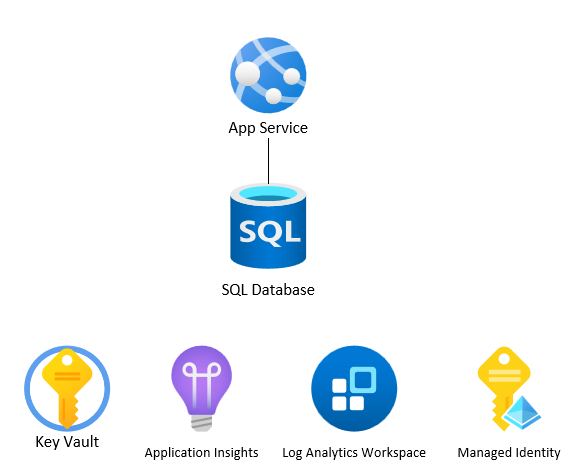

# web-app-iac



This repo demostrates how to build & deploy a .NET Core Web App using both Azure Bicep & Terraform to Azure. It also includes Azure DevOps pipelines to build & deploy to Azure.

## Disclaimer

**THE SOFTWARE IS PROVIDED "AS IS", WITHOUT WARRANTY OF ANY KIND, EXPRESS OR IMPLIED, INCLUDING BUT NOT LIMITED TO THE WARRANTIES OF MERCHANTABILITY, FITNESS FOR A PARTICULAR PURPOSE AND NONINFRINGEMENT. IN NO EVENT SHALL THE AUTHORS OR COPYRIGHT HOLDERS BE LIABLE FOR ANY CLAIM, DAMAGES OR OTHER LIABILITY, WHETHER IN AN ACTION OF CONTRACT, TORT OR OTHERWISE, ARISING FROM, OUT OF OR IN CONNECTION WITH THE SOFTWARE OR THE USE OR OTHER DEALINGS IN THE SOFTWARE.**

## Prerequisites

- [Azure CLI](https://docs.microsoft.com/en-us/cli/azure/install-azure-cli)
- [PowerShell](https://docs.microsoft.com/en-us/powershell/scripting/install/installing-powershell?view=powershell-7.1)
- [Terraform](https://www.terraform.io/downloads.html)
- [Bicep](https://docs.microsoft.com/en-us/azure/azure-resource-manager/bicep/install)
- Azure subscription & resource group

## Deployment

```
cd ./infra/bicep

az deployment group create --resource-group rg-webAppIaC-ussc-bicep --template-file ./main.bicep --parameters ./env/dev.parameters.json --parameters administratorLogin= administratorLoginPassword=

cd ../../src/demoWebApp

dotnet run

dotnet publish --configuration Release

Compress-Archive -Path ./bin/Release/net7.0/publish/* -DestinationPath ../demoWebApp.zip -Update

az webapp deployment source config-zip --src ../demoWebApp.zip -n wa-webAppIaC-ussc-bicep -g rg-webAppIaC-ussc-bicep

cd ../../infra/terraform

terraform init

terraform plan -var-file ./env/dev.tfvars -var 'sql_username_secret_value=' -var 'sql_password_secret_value='

terraform apply -var-file ./env/dev.tfvars -var 'sql_username_secret_value=' -var 'sql_password_secret_value='

cd ../../src/demoWebApp

az webapp deployment source config-zip --src ../demoWebApp.zip -n wa-webAppIaC-ussc-terraform -g rg-webAppIaC-ussc-terraform
```

## Links

- [Azure Bicep](https://docs.microsoft.com/en-us/azure/azure-resource-manager/bicep/overview)
- [Azure Terraform](https://www.terraform.io/docs/providers/azurerm/index.html)
- [Azure DevOps](https://docs.microsoft.com/en-us/azure/devops/pipelines/?view=azure-devops)
- [Azure DevOps YAML](https://docs.microsoft.com/en-us/azure/devops/pipelines/yaml-schema?view=azure-devops&tabs=schema)
- [App Service](https://docs.microsoft.com/en-us/azure/app-service/)
- [Azure SQL Database](https://docs.microsoft.com/en-us/azure/azure-sql/)
- [Azure Key Vault](https://docs.microsoft.com/en-us/azure/key-vault/general/basic-concepts)
- [Azure Monitor](https://docs.microsoft.com/en-us/azure/azure-monitor/overview)
